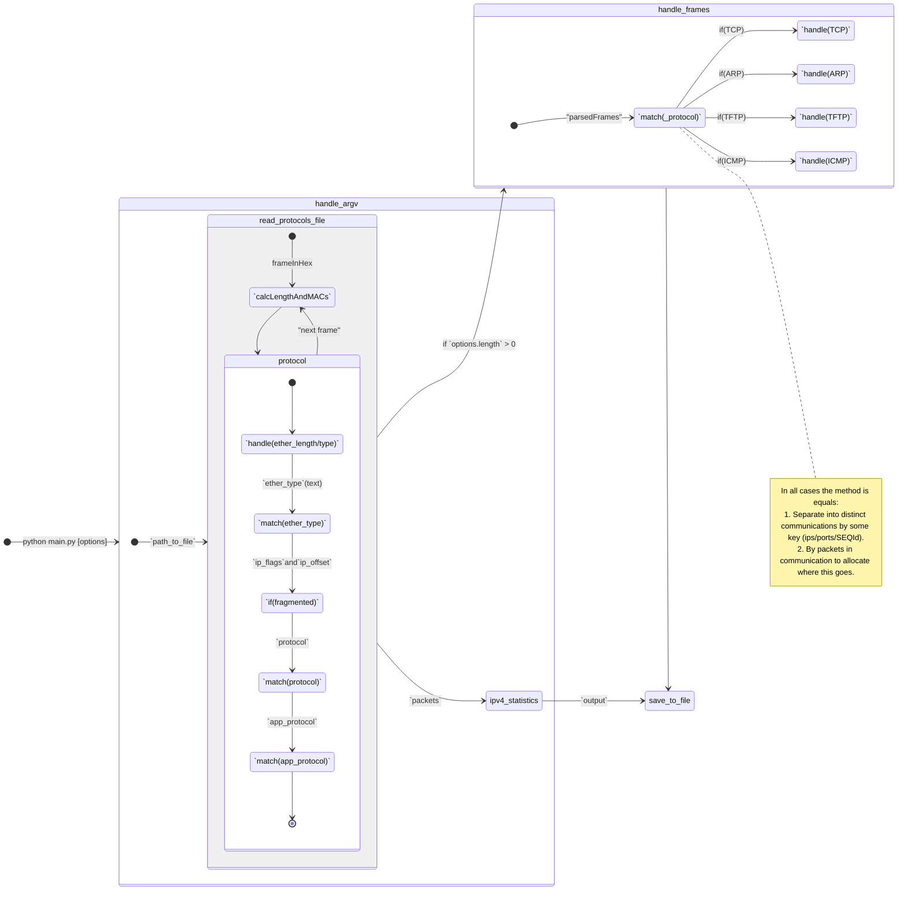

## Zadanie úlohy

Cieľom práce je navrhnutie a implementovanie programového analyzátora Ethernet siete, ktorý
analyzuje komunikácie v sieti zaznamenané v načítanom .pcap súbore a poskytuje nasledujúce
informácie o komunikáciách:

1. Výpis všetkých rámcov v hexadecimálnom tvare
2. Výpis IP adries a vnorených protokol na 2-4 vrstve
3. Pre IPv4 packety štatistika
4. Analýza protokolov s komunikáciou so spojením
5. Analýza protokolov s komunikáciou bez spojenia
6. Analýza ICMP
7. Analýza ARP
8. IP fragmentácia
9. Dokumentácia
10. Efektívnosť

## Program

Program je vytvorený v programovacom jazyku `Python 3.10.11`. Pre správne fungovanie sa
využíva knižnica `dkpt` a `ruamel`, ktorá slúži iba pre správne načítanie súboru.

Program je vytvorený, ako normálne CLI a používa nasledujúce parametre:

```cmd
use:
   python main.py <path_to_file> [options]
options:
  -p, --protocol [HTTP|HTTPS|TELNET|SSH|FTP_session|FTP_data]
  ```

Po spustení programu a platnej ceste k súboru bude program postupovať podľa nasledujúceho algoritmu:

## Algorithm

1. Načíta súbor s protokolmi a zapíše ich do globálnej premennej na jednoduché použitie prostredníctvom funkcie.
    - ```python
        def read_protocols_file(file_path):
            global protocols # is global variable
            from ruamel.yaml import YAML
            yaml = YAML()
            with open(file_path, 'r') as file:
                protocols = yaml.load(file)
        ```
2. Načíta súbor z paketmi a spustí cyklus čítania balíkov cez `dpkt`.
    - ```python
        with (open(file_path, 'rb') as file):
            pcap = dpkt.pcap.Reader(file)

            index = 0
            for timestamp, buf in pcap:
                # ...
       ```
3. Ďalšie analyzuje balík a zapíše hotovú verziu so všetkými potrebnými atribútmi do lokálnej premennej so
   všetkými balíkmi.
    1. Na začiatku sa definuje typ rámca siete Ethernet:
        - ```python
          if ether_length >= b'\x06x00':
              packet['frame_type'] = 'ETHERNET II'
              packet['ether_type'] = getProtocol('ether_type', ether_length)
              buf = buf[14:]
          else:
              if ether_length <= b'\x05\xDC':
                  packet['frame_type'] = 'IEEE 802.3 LLC'
                  packet['sap'] = getProtocol('sap', buf[14:15])

                  if packet['sap'] == 'SNAP':
                      packet['pid'] = getProtocol('pid', buf[20:22])
              else:
                  packet['frame_type'] = 'IEEE 802.3 RAW'
            ```
    2.
4. Funkcia pre štatistiky - prevezme pripravené, analyzované pakety a na ich základe zistí počet paketov vzhľadom na
   IP adresy.
5. `if parameters.len < 1`
    1. Zapíše sa do súboru s rovnakým názvom, ako je požadovaný, ale s rozšírením `.yaml`, a zapíše sa aj do konzoly.
6. `if parameters.len >=1`
    1. Funkcie týkajúce sa zadaného protokolu - analyzuje pakety, zapisuje do lokálnej premennej všetky komunikácie a
       potom zapisuje výsledok do súboru a na konzolu.



> Idea je v tom aby mat `switch`y/`match`y na handlovanie frameov/paketov/segmentov. Toto dava možnosti jednoduchej
> pridávania parsovania nového protokoly, pridávanie nových policek a tak dalej…

### `handle_frames` (from diagram)

Pre handlovanie zadaného protokoly ja používam uz existujúcu logiku pre parsovanie frameov (uz parsovani framei). Pre
identifikáciu packetov, ja musim uz mat parsovany informáciu z funkcii `handle_frames`, hovorím o dodatočných poličkach.

Vo všetkých prípadoch je metóda rovnaká:

1. Rozdeľte komunikáciu na samostatné komunikácie podľa určitého kľúča (ips/ports/SEQId).
2. Podľa paketov v komunikácii rozdeliť, kam to ide.

### `getProtocol`

Pre identifikáciu protokolov je použitej externe subor, v ktorom su zapísaný protokoly v formate `YAML`, ktorý potom je
zapísané do lokálnej premenní, na _optimalizáciu_. V samostatnej logike potom je použitá pomocná funkcia na zoberanie
protokolov podla hex a názvov:

```python
def getProtocol(type, hex_type):
    key = int.from_bytes(hex_type, 'big')
    if key in protocols[type]:
        return protocols[type][key]
    # print('UNK protocol: ', ''.join('{:02x}'.format(b) for b in hex_type))
    return None
```

```python
if packet['sap'] == 'SNAP':
    packet['pid'] = getProtocol('pid', buf[20:22])
```

## Externé súbory

### `protocol.yaml`

Na identifikáciu protokolov - program používa ďalší súbor `protocols.yaml`, ktorý vyzerá takto:

```yaml
ether_type:
  0x0806: ARP
  0x0800: IPv4
  0x88CC: LLDP
  0x86DD: IPv6
  0x9000: ECTP
sap:
  0x42: STP
  0xE0: IPX
  0xF0: NETBIOS
pid:
  0x2000: CDP
  0x2004: DTP
  0x010B: PVSTP+
  0x809B: AppleTalk
ip:
  0x01: ICMP
  0x02: IGMP
  0x06: TCP
  0x11: UDP
  0x67: PIM
tcp:
  20: FTP-DATA
  21: FTP-CONTROL
  22: SSH
  23: TELNET
  # ...
udp:
  37: TIME
  53: DNS
  # ...
```

### `utils.py`

Dodatočné funkcie na formátovanie bajtov a bitov do čitateľného, správneho formátu boli vyvedené do iného súboru:
```python
def mac_format(hex_in_bytes):
    return ':'.join(format(x, '02x') for x in hex_in_bytes)


def ipv4_format(hex_in_bytes):
    return ".".join(map(str, hex_in_bytes))


def ipv6_format(hex_in_bytes):
    return ':'.join(format(int.from_bytes(hex_in_bytes[i:i + 2], 'big'), '04x') for i in range(0, 16, 2))


def hex_format(hex_in_bytes):
    from ruamel.yaml.scalarstring import LiteralScalarString
    return LiteralScalarString(
        '\n'.join(' '.join(f'{b:02X}' for b in hex_in_bytes[i:i + 16]) for i in range(0, len(hex_in_bytes), 16)) + '\n')
```

## Zhodnotenie

Táto úloha mi pomohla pochopiť, ako sú protokoly štruktúrované a ako presne fungujú, čo je to trojcestný handshake a
podobne.

### Efektívnost

| Pocet paketov v subory | Cas v sek | Packet/sec |
|------------------------|-----------|:-----------|
| 351                    | 0.1767    | 0.00036    |
| 243                    | 0.084     | 0.00013    |
| 17                     | 0.0559    | 0.00034    |
| 37                     | 0.0583    | 0.00022    |
| 1025                   | 0.1671    | 0.00011    |
| 481                    | 0.0967    | 0.00009    |
| 3                      | 0.0499    | -          |

Je mozne rozmyslieť ze minimum pre program je `0.05` sec pre 0 paketov, takze pre jeden paket priemerná rýchlosť
parsovanie bude sa rovnať **`0.00020` sec**.

### Rozšírenie

Ak ste chcete rozsiriet -> pridajte novy `case` alebo nove policko do `dict`.
